# Fashion Store App

Fashion Store App is the ultimate buying associate that combines beauty with efficiency. With sturdy kingdom control using Provider, you will experience actual-time updates and a responsive shopping cart. We've integrated the fakestoreapi.Com to provide a huge choice of real products.

Our app boasts stable JWT-based authentication for fear-unfastened transactions and information protection. Explore diverse product classes quite simply, add and put off items resultseasily from your cart, and revel in minimum loading times way to our efficient HTTP customer.

Fashion Store App gives international accessibility with localization aid, making sure a seamless purchasing experience tailored for your language and region. Dive deep into product details, descriptions, and reviews before making informed purchases.

Your safety is our priority, with stringent measures in vicinity to guard your statistics. Elevate your buying game with Fashion Store App, in which beauty meets efficiency inside the international of on-line retail.
The Fashion Store App is the ultimate shopping companion that combines beauty and functionality. With robust supply chain management, you get real-time updates and a responsive shopping cart. We have put together fakestoreapi.com to provide a wide selection of authentic products.

Our app boasts secure JWT-based authentication for worry-free transactions and data security. Easily browse various items, add and remove items from your cart effortlessly, and enjoy minimal loading time thanks to our efficient HTTP client.

The Fashion Store App provides global access with local support, ensuring an easy shopping experience tailored to your language and region. Engage in detailed product descriptions, descriptions and research before making an informed purchase.

Your security is our number one priority, and we have put in place strict measures to protect your data. Step up your shopping game with the Fashion Store App, where beauty meets efficiency in the world of online shopping.

## Table of Contents

- [Key Features](#key-features)
- [Screenshots](#screenshots)
- [Installation](#installation)
- [Usage](#usage)
- [API Integration](#api-integration)
- [Authentication](#authentication)
- [State Management](#state-management)
- [Localization](#localization)
- [Contributing](#contributing)
- [License](#license)

## Key Features

- **State Management Excellence:** Powered by the robust Provider package, [Fashion Store App] delivers a dynamic and responsive shopping experience. Enjoy real-time updates, instant cart adjustments, and efficient data handling.

- **API Magic:** We've partnered with the [fakestoreapi.com](https://fakestoreapi.com/) to provide you with an ever-expanding inventory of authentic products. Our API integration ensures that you access the latest and greatest deals effortlessly.

- **Efficient HTTP Client:** Behind the scenes, our app leverages a lightning-fast HTTP client to retrieve product information, reviews, and more. Experience minimal loading times and maximum performance.

- **Secure Authentication:** Your privacy matters. Our JWT-based authentication system guarantees secure transactions and safeguards your personal information.

- **Diverse Product Selection:** Explore an extensive range of products, from electronics and fashion to home decor and more. With our user-friendly categories, finding what you need is a breeze.

- **Shopping Cart Perfection:** Managing your shopping cart has never been this easy. Add or remove items with a single tap, and watch as your cart updates instantly.

- **Global Accessibility:** To cater to a global audience, [Fashion Store App] offers localization support. Enjoy a seamless shopping experience in your preferred language and region.

- **In-Depth Product Insights:** Dive deep into product details, descriptions, and customer reviews. Make well-informed purchasing decisions with all the information at your fingertips.

- **Data Security:** Your security is our top priority. We employ stringent security measures to protect your data and ensure secure transactions.

## Screenshots

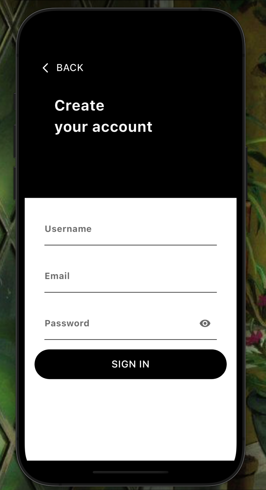
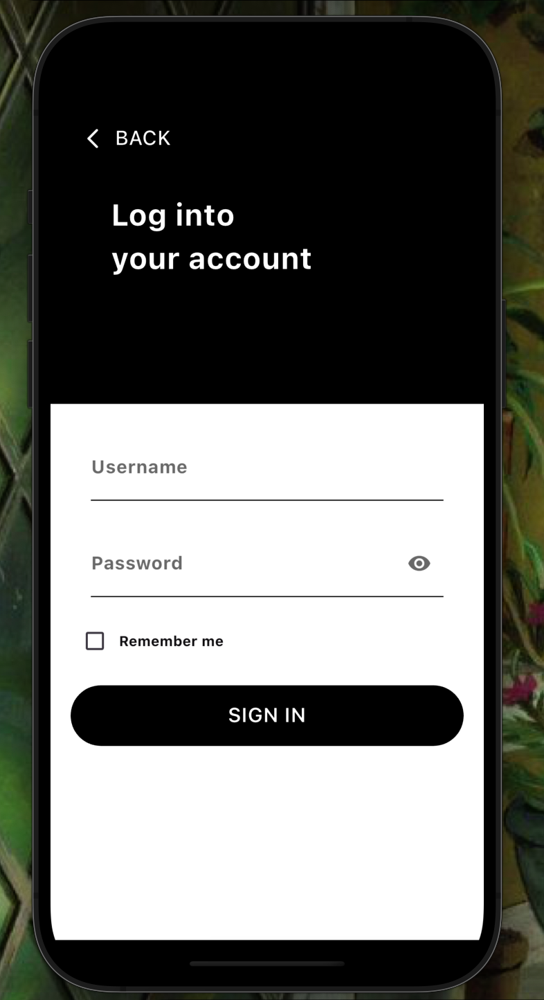
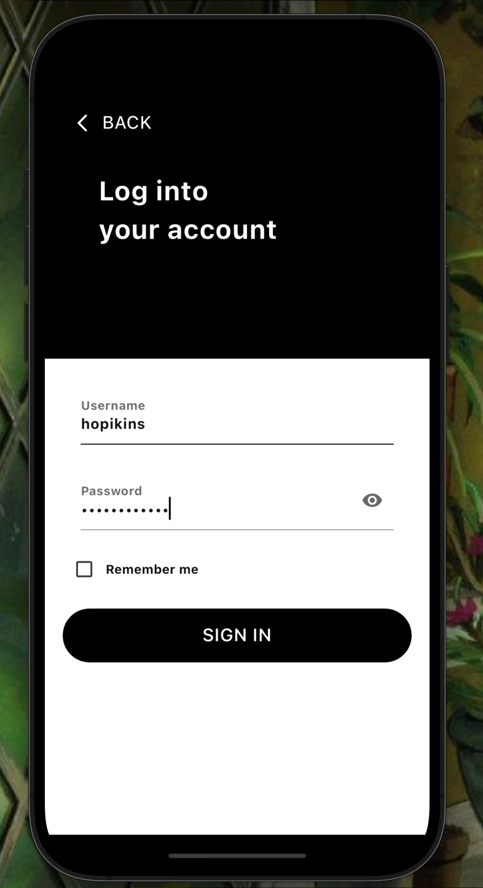
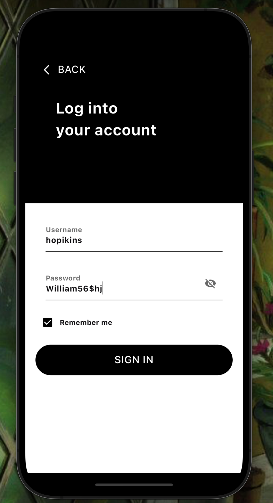
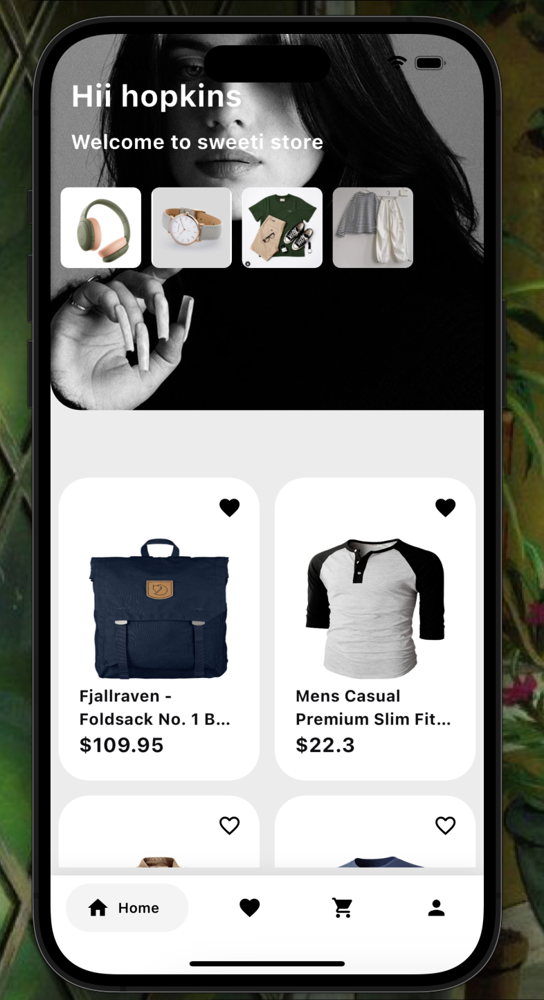
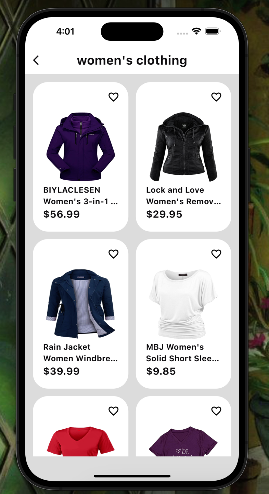
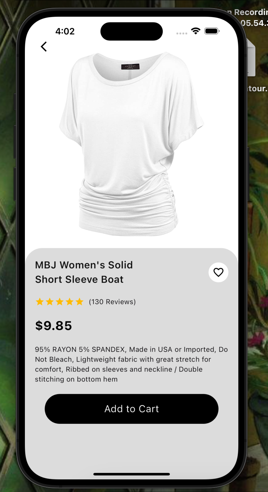
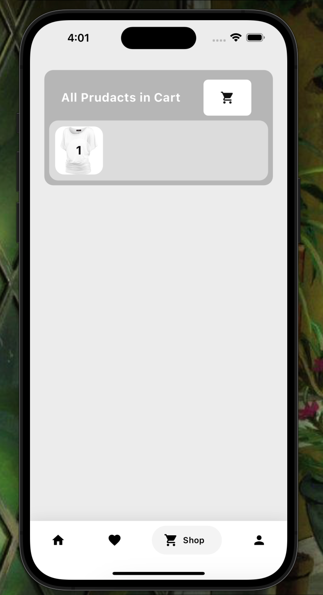
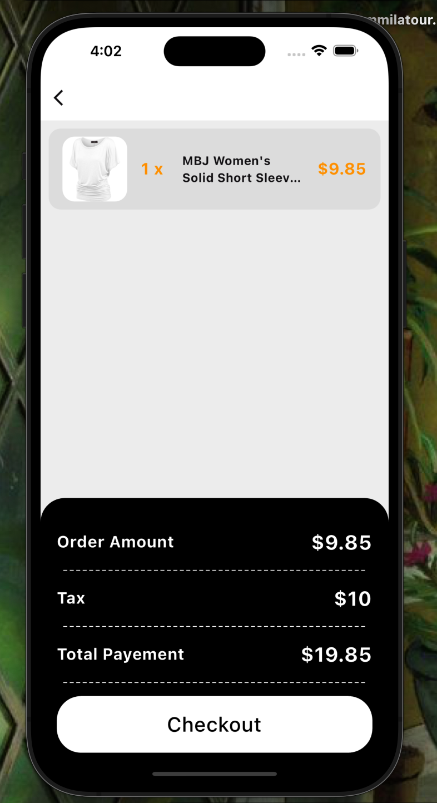
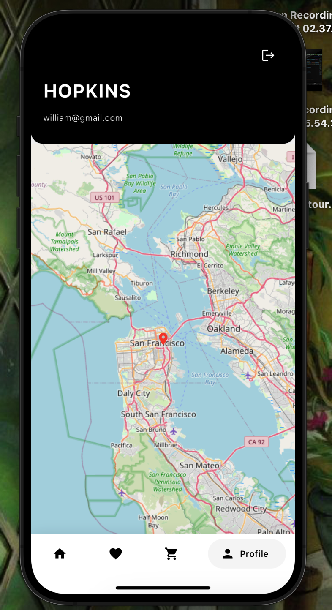
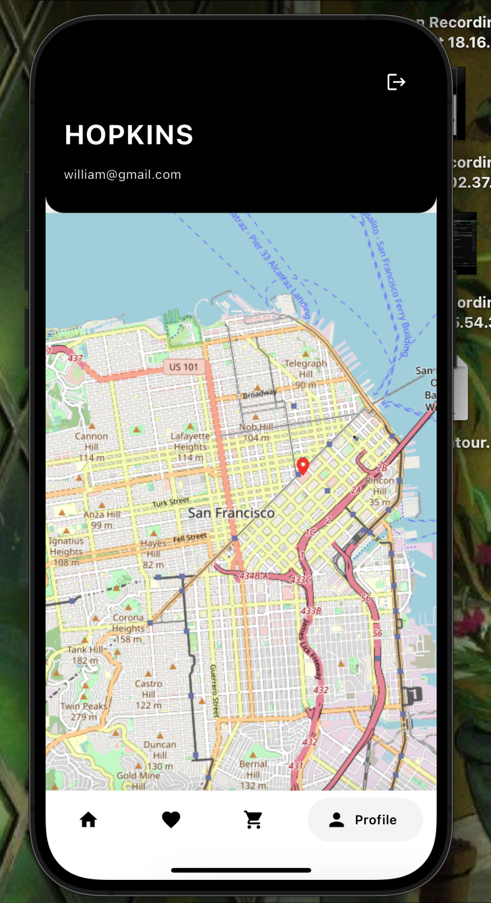

## Installation

- Clone this repository: `git clone https://github.com/mfagri/Fashion_Store_App.git`
- Navigate to the project directory: `cd [Your Repository Name]`
- Install dependencies: `flutter pub get`

## Usage

- Run the app: `flutter run`

## API Integration

Fashion Store App integrates with the [fakestoreapi.com](https://fakestoreapi.com/) to provide you with a wide range of products. Ensure you have an internet connection to access the latest products and updates.

## Authentication

Fashion Store App uses JWT-based authentication to secure user data and transactions. Your privacy and security are paramount.

## State Management

State management in [Fashion Store App] is powered by the Provider package. Enjoy real-time updates and seamless cart management.

## Localization

Fashion Store App supports localization to provide a tailored shopping experience in your preferred language and region.

## Contributing

We welcome contributions! Feel free to submit issues and pull requests.
